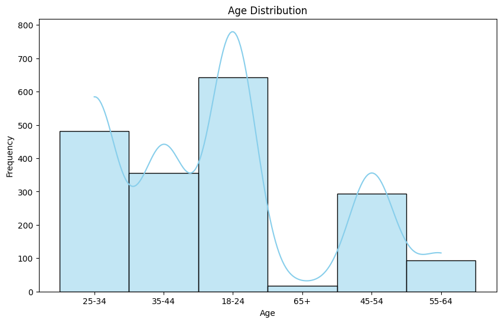
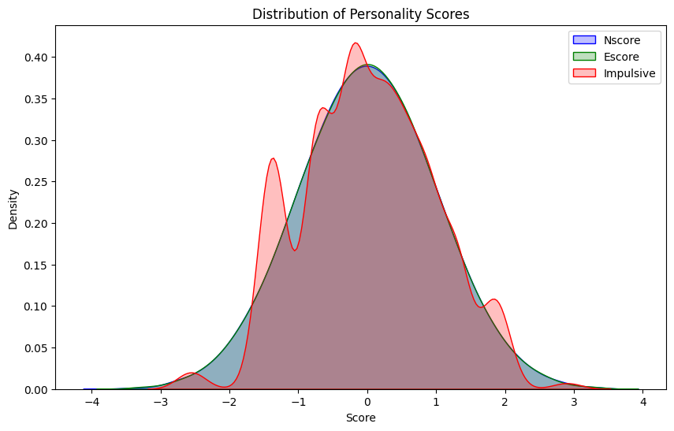
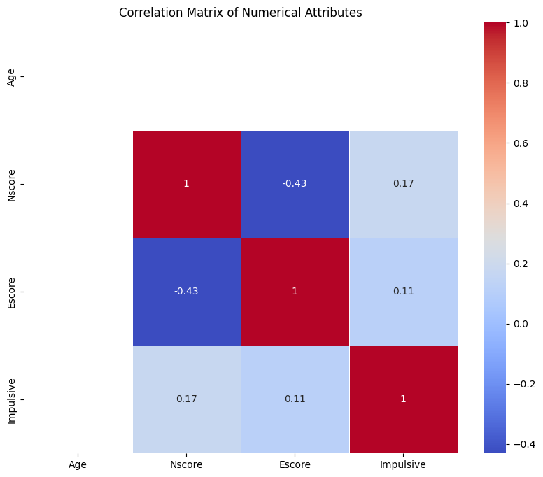
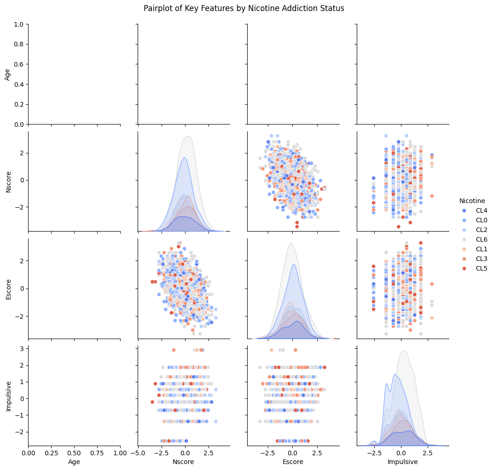

# Analyzing the New Generation of Nicotine Addiction
## Overview
This project investigates the impact of e-cigarettes and vapes on nicotine addiction rates, particularly among younger demographics. Using demographic and personality data, machine learning models were employed to predict nicotine addiction status and identify key contributing factors. This study provides insights into behavioral patterns and strategies for targeted interventions to reduce nicotine dependency.

## Problem Statement
The emergence of e-cigarettes and vapes has shifted nicotine consumption patterns, leading to increased addiction rates in younger populations. This project aims to:

    Analyze the influence of personality traits and demographics on nicotine addiction.
    Build predictive models to identify individuals at risk of addiction.
    Highlight actionable insights for health interventions.

## Data Source
The dataset for this analysis was obtained from a public repository, containing 1,885 records and 32 attributes, including:

Demographics: Age, Gender, Country
Personality Traits: Neuroticism Score (Nscore), Extroversion Score (Escore), Impulsiveness (Impulsive)
Target Variable: Nicotine addiction status

## Exploratory Data Analysis (EDA)
Key steps in EDA included:

Distribution Analysis:
Most participants were aged 18–30, with personality scores distributed normally.
Correlation Analysis:
Weak correlations were observed between age and personality traits.
Outlier Detection:
Boxplots identified minor outliers in impulsiveness scores.
Key Insights:
Impulsiveness and neuroticism emerged as critical predictors of nicotine addiction.

## Visualizations
Age Distribution Histogram: Highlighted the prevalence of younger participants.
Correlation Heatmap: Showed relationships between numerical features.
Feature Importance Plot: Identified top predictors like impulsiveness and neuroticism.

## Machine Learning Models
Three machine learning models were developed:

Logistic Regression: Offered interpretability but had lower accuracy.
Random Forest Classifier: Achieved the best performance with:
Accuracy: 85%
F1-Score: 0.86
Support Vector Machine (SVM): Balanced precision and recall but underperformed compared to Random Forest.

### Implementation Highlights
Data Preprocessing: Scaling and encoding to standardize features.
Train-Test Split: 80% training, 20% testing.
Hyperparameter Tuning: Optimized model parameters using grid search.

### Results
The Random Forest Classifier was the most effective model.
Personality traits (Impulsiveness, Neuroticism) were the strongest predictors of nicotine addiction.

## Limitations
Potential bias in survey-based data.
Lack of longitudinal data to track addiction trends over time.
Missing values in some demographic attributes, which reduced data completeness.

## Future Work
Incorporate longitudinal datasets to analyze long-term patterns in nicotine addiction.
Include additional features, such as socioeconomic factors and environmental influences.
Explore the use of deep learning models for enhanced predictive capabilities.

## Abstract
This study explores the effects of e-cigarettes and vapes on nicotine addiction rates. Using machine learning models and visualization tools, the analysis revealed that impulsiveness and neuroticism significantly contribute to addiction. The Random Forest Classifier achieved high predictive accuracy (F1-score: 0.86), offering insights into addiction behaviors and informing targeted interventions.

## Screenshots
### Age Distribution Histogram

### KDE Plot of Personality Scores

### Correlation Heatmap

### Pairplot for Numerical Features
